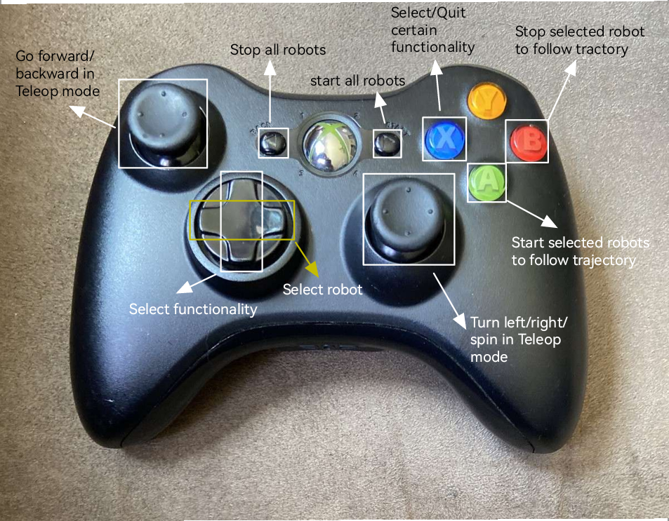

# pololu3pi2040
This is a firmware written in Rust for the [Pololu 3pi+ 2040 robot](https://www.pololu.com/category/300/3pi-plus-2040-robot) and [Pololu Zumo 2040 robot](https://www.pololu.com/category/308/zumo-2040-robot). It's a differential-drive robot that can move with up to 4 m/s very fast and has a RP2040 (RPI Pico)-based hardware.

## Hardware

The board seems to be an almost unmodified Rpi Pico, with a relatively small library on top for drivers. 

Detailed documentation including Pin mappings are available in the [User Guide](https://www.pololu.com/docs/0J86).

[C-Firmware](https://github.com/pololu/pololu-3pi-2040-robot/tree/master/c/pololu_3pi_2040_robot)
[Python-Firmware](https://github.com/pololu/pololu-3pi-2040-robot/tree/master/micropython_demo/pololu_3pi_2040_robot)
[Micropython](https://github.com/pololu/micropython-build)

### Yellow LED

The official blinky examples works - the yellow LED is connected to GPIO25.

[C driver](https://github.com/pololu/pololu-3pi-2040-robot/blob/master/c/pololu_3pi_2040_robot/yellow_led.c)


### Motors

- GPIO10 sets direction of the right motor
- GPIO11 sets the direction of the left motor
- PWM7 channel a, Pin14 controls the right motor
- PWM7 channel b, Pin15 controls the left motor

[C driver](https://github.com/pololu/pololu-3pi-2040-robot/blob/master/c/pololu_3pi_2040_robot/motors.c)
[Python driver](https://github.com/pololu/pololu-3pi-2040-robot/blob/master/micropython_demo/pololu_3pi_2040_robot/motors.py)

### quadrature encoders

No C driver
[Python driver](https://github.com/pololu/pololu-3pi-2040-robot/blob/master/micropython_demo/pololu_3pi_2040_robot/encoders.py) with [PIO](https://github.com/pololu/pololu-3pi-2040-robot/blob/master/micropython_demo/pololu_3pi_2040_robot/_lib/pio_quadrature_counter.py)

### IMU

- LSM6DSO (6-axis IMU)
- LIS3MDL (3-axis magnetometer)
- Connected over I2C (SCL: 5, SDA: 4)

No C driver
[Python driver](https://github.com/pololu/pololu-3pi-2040-robot/blob/master/micropython_demo/pololu_3pi_2040_robot/imu.py) [Low-Level LIS2MDL](https://github.com/pololu/pololu-3pi-2040-robot/blob/master/micropython_demo/pololu_3pi_2040_robot/_lib/lis3mdl.py) [Low-level LSM6DSO](https://github.com/pololu/pololu-3pi-2040-robot/blob/master/micropython_demo/pololu_3pi_2040_robot/_lib/lsm6dso.py)


### OLED Display

- SH1106 OLED
- Connected via SPI (data: 0, reset: 1, sck: 2, mosi: 3)
[Python driver](https://github.com/pololu/pololu-3pi-2040-robot/blob/master/micropython_demo/pololu_3pi_2040_robot/display.py)


### RGB LEDs
The 3pi+ 2040 control board also features six individually-addressable RGB LEDs. The RGB LEDs have integrated drivers compatible with the popular APA102 addressable LED, and they are chained together in alphabetical order (labeled A through F) and arranged counterclockwise on the board.

The control board uses SPI0, one of its two hardware SPI modules, on GP3 and GP6 (TX and SCK, respectively) to control the RGB LEDs. The 3pi+ 2040 libraries include functions that make it easier to control the RGB LEDs and use them together with the OLED display, which shares the SPI0 interface with the RGB LEDs. The display and RGB LEDs share a common pin for SPI0 TX (data), but use different pins for SPI0 SCK (clock), allowing them to be controlled separately.

- TX: GP3(SPI0)
- SCK: GP6(SPI0)

[C driver](https://github.com/pololu/pololu-3pi-2040-robot/blob/master/c/pololu_3pi_2040_robot/rgb_leds.c)
[Python driver](https://github.com/pololu/pololu-3pi-2040-robot/blob/master/micropython_demo/pololu_3pi_2040_robot/rgb_leds.py)

### USB-C Interface

### Line sensors
The five line sensors are on the underside of the board along the front edge and can help the 3pi+ distinguish between light and dark surfaces. Each reflectance sensor consists of a down-facing infrared (IR) emitter LED paired with a phototransistor that can detect reflected infrared light from the LED. The reflectance sensors operate on the same principles as our RC-type QTR reflectance sensors: the RP2040 uses an I/O line to drive the sensor output high, and then measures the time for the output voltage to decay.
- Line sensor emitter control pin(DNE): PIN_26
- DN1: PIN_22
- DN2: PIN_21
- DN3: PIN_20
- DN4: PIN_19
- DN5: PIN_18

[C driver](https://github.com/pololu/pololu-3pi-2040-robot/blob/master/c/pololu_3pi_2040_robot/ir_sensors.c)
[Python driver](https://github.com/pololu/pololu-3pi-2040-robot/blob/master/micropython_demo/pololu_3pi_2040_robot/ir_sensors.py)

### Bump sensors
The two bump sensors are also reflectance sensors, but rather than providing simple reflectance readings, these are designed to measure changes in reflected light as the corresponding bump sensor flaps on the front of the 3pi+’s bumper skirt are pressed (deflected). This allows the 3pi+ to detect when it has contacted another object in front of it and determine which side the contact is on.
- Bump sensors emitter control pin(BE): PIN_23
- BL: PIN_17
- BR: PIN_16
[C driver](https://github.com/pololu/pololu-3pi-2040-robot/blob/master/c/pololu_3pi_2040_robot/ir_sensors.c)
[Python driver](https://github.com/pololu/pololu-3pi-2040-robot/blob/master/micropython_demo/pololu_3pi_2040_robot/ir_sensors.py)

### Buzzer
By default, it is connected to GP7, which can be configured as PWM3 B to produce hardware pulse width modulation.
- Buzzer: PIN_7

[Python driver](https://github.com/pololu/pololu-3pi-2040-robot/blob/master/micropython_demo/pololu_3pi_2040_robot/buzzer.py)

### Push Buttons
Pressing one of the user pushbuttons pulls the associated I/O pin to ground through a resistor.
- Button A: PIN_25
- Button B: QSPI_SS_N(PIN_1)
- Button C: PIN_0
Notice: Button A is conflict with the LED pin. User should select the function of the pin when initialize it, or change it in need.

[C driver](https://github.com/pololu/pololu-3pi-2040-robot/blob/master/c/pololu_3pi_2040_robot/button.c)
[Python driver](https://github.com/pololu/pololu-3pi-2040-robot/blob/master/micropython_demo/pololu_3pi_2040_robot/buttons.py)

### Flash memory

### SD Card Deck
Adopted from [Crazyflie uSD deck](https://www.bitcraze.io/products/micro-sd-card-deck/). The deck use spi to write/read data to/from the micro SD Card. The deck now is assigned to SPI0, the pin mapping is shown as:
- SPI_SCK: PIN_18
- SPI_MOSI: PIN_19
- SPI_MISO: PIN_20
- SPI_CS: PIN_21
#### Notice
* The current connection is conflict with the line sensors, which means that we have to disable the line sensors if we would like to log data to SD Card.

## Rust

There are two major frameworks: [embedded-hal](https://github.com/rp-rs/rp-hal-boards/tree/main/boards/rp-pico) + [RTIC](https://rtic.rs) or [Embassy](https://embassy.dev)

[Blog-post](https://willhart.io/post/embedded-rust-options/)

## Flash

### Important Notice!!!!!!!!!!!
The newest version `1.89.0` of `rustc` is released on 4th Aug 2025. However, the flashing with `elf2uf2-rs -d` might suffers some temporary issues. For example, an error `unregonized ABI` occurs because of the generated elf header doesn't match the requirements of the elf2uf2 runner. (The generated 8th bit of the header is `03`, which indicates that the OS/ABI type is `UNIX - GNU`, but actually should be `00`, which indicates `UNIX - System V`).

There are 2 ways to solve this issue:
- If you really need the newest rustc, then each time after you build the project you should enter you target folder and do:
```
printf '\x00' | dd of=teleop_control bs=1 seek=7 count=1 conv=notrunc
```
This will change the 8th bit from `03` to `00` and then you can flash this as usual (don't build it again).

- The other way is to downgrade rustc to `1.87.0` by using:
```
rustup toolchain install 1.87.0
rustup default 1.87.0
rustup component add rust-src --toolchain 1.87.0
rustup target add thumbv6m-none-eabi --toolchain 1.87.0
```
This will solve all problems.

### Using the `./run` Script (Recommended)

The project includes a convenient `./run` script for building and flashing different robot configurations:

```bash
# Make executable (first time only)
chmod +x run

```
Then: 
* Press "B" + Reset on the Robot

```bash
# Examples:
./run                    # Default config, main binary
./run zumo              # Zumo config, main binary
./run zumo teleop       # Zumo config, teleop_control binary
./run 3pi trajectory    # 3Pi config, trajectory_following binary
```

### Manual Cargo Commands

* Press "B" + Reset on the Robot
* `cargo run --release` will flash and run the firmware with default configuration
* `cargo run --release --features zumo` for Zumo robot
* `cargo run --release --features 3pi` for 3Pi robot

See [README_BUILD_SYSTEM.md](README_BUILD_SYSTEM.md) for complete documentation.

## Multi-Robot Support

This firmware supports both **Zumo** and **3Pi** robots with different physical parameters and configurations:

### Robot Configurations

#### Zumo Robot (`--features zumo`)
- **Gear Ratio**: 100.31
- **Wheel Radius**: 0.02m
- **Wheel Base**: 0.099m
- **Motor Direction**: Reversed (`-duty_left`, `-duty_right`)
- **Encoder CPR**:  1203.72 (100.31 × 12.0)

#### 3Pi Robot (`--features 3pi`)
- **Gear Ratio**: 15.25
- **Wheel Radius**: 0.016m
- **Wheel Base**: 0.0842m
- **Motor Direction**: Normal (`duty_left`, `duty_right`)
- **Encoder CPR**: 183.0 (15.25 × 12.0)

#### Default/Testing (no features)
- **Configuration**: Currently set to Zumo parameters for testing
- **Use Case**: Development and testing without robot-specific compilation

### Parameter Comparison Table

| Parameter       | Zumo Robot | 3Pi Robot | Default/Testing |
| --------------- | ---------- | --------- | --------------- |
| Gear Ratio      | 100.31     | 15.25     | 100.31          |
| Wheel Radius    | 0.02m      | 0.016m    | 0.02m           |
| Wheel Base      | 0.099m     | 0.0842m   | 0.099m          |
| Motor Direction | Reversed   | Normal    | Reversed        |
| Encoder CPR     | 1203.72    | 183.0     | 1203.72         |

### Quick Start Examples:
```bash
./run zumo teleop                 # Flash teleop control to Zumo
./run 3pi trajectory_following    # Flash trajectory following to 3Pi  
./run                             # Use default config for testing
```

## USB Logging

```
sudo apt install tio
tio /dev/ttyACM0
```
(use ctrl+t q to exit)

## Project Structure
- `src/`: Source code
  - `main.rs`: The entry point of the project.
  - `init.rs`: Initialization for all devices.
  - `lib.rs`: Integrated libraries with feature-based module selection.
  - `led.rs`: Default LED driver.
  - `buzzer.rs`: Buzzer driver.
  - `diffdrive.rs`: differential flatness computation for trajectory generation and following
  - `motor.rs`: Driver of both motors.
  - `encoder.rs`: Encoder driver for both encoders using PIO.
  - `uart.rs`: UART0 driver.
  - `packet.rs`: Defines the packet according to [Crazyflie_Packet](https://github.com/IMRCLab/crazyflie-link-cpp/blob/startTraj_example/examples/PacketUtils.hpp).

  **Robot-specific adaptions in application layer**
  - `joystick_control.rs`: Default/testing configuration (currently Zumo parameters)
  - `trajectory_control.rs`: Trajectory following controller.
  - `trajectory_read.rs`: Read trajectory from preset json file.
  - `trajectory_signal.rs`: Event/Update signals definition.
  - `trajectory_uart.rs`: Receive poses from Mocap.
  - `bin/`: Binary targets
    - `teleop_control.rs`: Teleop control application
    - `trajectory_following.rs`: Cascade Trajectory following application
  - `imu/`: IMU library.
    - `lis3mdl.rs`: Driver for the 3-axis magnetometer.
    - `lsm6dso.rs`: Driver for the combined 3-axis accelerometer and 3-axis gyrometer.
    - `shared_i2c.rs`: A shared I2C bus for reusing the same I2C for the combined 3-axis accelerometer and 3-axis gyrometer.
    - `complementary_filter.rs`: Complementary filter to estimate Roll/Pitch/Yaw.
    - `madgwick.rs`: Madgwick filter to estimate Roll/Pitch/Yaw (under developing).
- `memory.x`: Defines the memory layout of RP2040 (SRAM and Flash).
- `.cargo/config.toml`: Specifies the target platform as `thumbv6m-none-eabi` for RP2040.
- `Cargo.toml`: Declares project metadata, Rust edition, dependencies, and feature flags for robot selection.
- `build.rs`: A custom build script to ensure the `memory.x` linker script is properly included during compilation.
- `run`: Build script for easy robot and binary selection (see [README_BUILD_SYSTEM.md](README_BUILD_SYSTEM.md)).
- `README_BUILD_SYSTEM.md`: Comprehensive documentation for the build system and robot configurations. `thumbv6m-none-eabi` for RP2040.
- `Cargo.toml`: Declares project metadata, Rust edition, and dependencies.
- `build.rs`: A custom build script to ensure the `memory.x` linker script is properly included during compilation.


## Logging with Raspberry Pi Debug Probe
The logging is mainly based on [probe-rs](https://probe.rs/docs/getting-started/installation/), [defmt](https://docs.rs/defmt/latest/defmt/) and [defmt-rtt](https://docs.rs/defmt-rtt/latest/defmt_rtt/).
There is also a useful [blog](https://murraytodd.medium.com/our-first-rust-blinky-program-on-raspberry-pi-pico-w-376211f1074d) to learn how to use them very quickly.

* Notice: The installation command on the home page of [probe-rs](https://probe.rs/) doesn't work for me due to some package conflicts. If so you could try following the [instructions](https://probe.rs/docs/getting-started/installation/) and install it from source.

### Debug Setup
* You will need a Raspberry Pi Debug Probe(for debugging) and a USB-C Cabel(for flashing).
* connect the probe properly to the Pololu. If the official probe is used, the connection should be:
```
Yellow(SWDIO) -> SWDIO
Green(SWCLK)  -> SWCLK
Black(GND)    -> GND 
``` 
Then connect the Pololu with the USB-C cabel to your PC, and the debug probe as well and uncomment in config.toml

```runner = "probe-rs run --chip RP2040 --protocol swd" ```

* If you would like to directly observed the debug information in the terminal, run:
```
cargo run --release
```
* If you would like to save the logging information into a csv file, run:
```
cargo run --release > file_name.csv
```

**OR** 

flash in bootloader mode and without debug information in the terminal by uncommenting 

```runner = "elf2uf2-rs -d"```

in config.toml and then press "B" and "Reset" on the robot
and flash with
```
cargo run --release
```
or use the recommended [build system](README_BUILD_SYSTEM.md)

### Print New Debug Information 
The code only print a test value(constant). When new debug information is needed, use:
```
info!("New Sensor Data: {}", value);
```

## Logging with sd card
The SD card logging is built based on [Crazyflie micro sd card deck](https://www.bitcraze.io/products/micro-sd-card-deck/). The deck uses spi protocol to log data in and read data out from the micro sd card. There are mutiple available file format including `csv`, `txt` and `binary file` and different logging functions and some preset structs is provided for testing which can be modified later on according to individual use cases.


## Uart
### Packet Type
3 example packet types are defined in `packet.rs`:
- `CmdLegacyPacketU16`: including 4 U16 values.
- `CmdLegacyPacketF32`: including 4 F32 values.
- `CmdLegacyPacketMix`: including 2 U16 values adn 2 F32 values.

### Read Packet
Register a function `uart_receive_task` as an asychronous task to asychronously receive the new message.

* Notice: Even though the header defined in the Crazyflie-link sending example is `0xFF`, the `set_Channel((uint8_t) 0x00)` and `set_Port((uint8_t)0x03)` will change the header to `0x3C`.


## Motor
Provide with `set_speed` function to set direction and speed for both motors.


## Encoder
Use PIO Module to build the encoder driver. Provide the user with position reading function and rotation speed (RPM) reading function. A asynchronous reading task is implemented in `encoder/encoder.rs`.
Since the original PIO Encoder Module in the embassy library is too simple and only catches one falling edge in one phase (leads to the unstable rpm reading problem), a new PIO is provided for reading both falling edges and rising edges in both phases of the quadrature encoders.


## IMU
Provide `read_imu_task` function to read and estimate the euler angles. The task should be registered in main using spawn.


## Robot Configuration File
Since there is 2 different robot types, we need to specify the parameters for different robots. There are 2 ways to set them:
- By using the `./run` script with the corresponding feature. 
- By editing the `ROBOTCFG.CFG` and copy it to the onboard SD Card, the robot will automatically detect the file and load the params. (Be careful that this will overide the values set by the feature selecting in the `./run` script)


## Trajectory File Example
The trajectory waypoints can be either generated online or loaded from json file in certain format. Some example trajectory files are provided in `TRAJs` folder.


# How to use
## Menu
- Prepare the Robots:
  - Prepare the nRF Dongle and write down the address for the robot(if multiple dongles are running together then each dongle should have different address)
  - Change the `robot_id` according to the Dongle address of the current robot in file `src/bin/programm_entrance.rs`, the `robot_id` can be found here:
    ```
    spawner
      .spawn(orchestrator(spawner, devices, UartCfg { robot_id: 10 }))
      .unwrap();
    ```
  - Connect the Raspberry-Debug-Probe and a USB-C cable to the Pololu.
  - Flash the firmware to the robot using the following command:
    ```
    ./run 3pi menu
    ```
  - Paste the tuned robot configuration file in folder `cfg` to a micro sd card. Please DO NOT CHANGE the name of the configuration file, the file system depends on the file name to distinguish configuration file from other files.
  -  Paste the trajectory file to a micro sd card. Please DO NOT CHANGE the name of the trajectory file, the file system depends on the file name to distinguish configuration file from other files.
- Prepare the Trajectory Following ROS Node:
  - Connect a Crazyradio PA or Crazyradio 2 and a joystick to your PC.
  - Change the address for each robot in `workstation_ros/src/pololu_ros/config/controller_interface.yaml`.
  - Open workstation_ros folder and build the ros2 workspace using:
    ```
    colcon build
    ```
  - Open a terminal and run:
    ```
    source install/setup.bash
    ros2 run pololu_ros controller_interface
    ```
- Use the buttons on the joystick to select different functionalities.
  

### Controller Mapping
#### Robot Selection & Program Management
- **D-Pad Left/Right**: Select robot (cycles through robots 1-4)
- **D-Pad Up/Down**: Select program for current robot
- **X-Button**: Confirm program selection and send to robot

#### Robot Control
- **A Button**: Start selected robot with chosen program
- **B Button**: Stop selected robot
- **X Button**: Send program to robot OR quit current program
- **START Button**: Start ALL robots simultaneously
- **BACK Button**: Stops ALL robots (emergency stop)

**Note**: When stopping the robot, the program must be quit for each robot with the X button, before starting a program again.

#### Teleop Control
- **Left Stick**: Control selected robot when in teleop mode
  - Vertical axis: Linear velocity (forward/backward)
- **Right Stick**: Steering control
  - Horizontal axis: Steering angle (left/right)

### Available Programs
1. **Teleop**: Manual teleoperation mode (immediate control)
2. **Trajectory Following (Direct Duty)**: Follows pre-programmed trajectories with direct motor control
3. **Trajectory Following (MoCap)**: Follows trajectories using motion capture feedback (using position controller and speedcontrol)

### Usage Workflow
1. **Select Robot**: Use D-Pad Left/Right to choose which robot to control
2. **Choose Program**: Use D-Pad Up/Down to select the desired program
3. **Send Program**: Press X button to send the program to the robot
4. **Start Execution**: Press A button to start the program
5. **Control/Monitor**: 
   - For teleop: Use left stick to control the robot
   - For trajectories: Robot executes automatically
6. **Stop**: Press B to stop individual robot or BACK for emergency stop

## Tele-Operation for multiple robots
In addition to the controller interface node with the menu, there is another node that provides tele-operation functionality for multiple robots, who can simultaneously be controlled by with one controller for each robot respectively.

### Hardware Requirements
- Xbox controller (wired or wireless with USB adapter)
- Compatible joystick device recognized by `joy_linux`

### Setup Steps:
- Prepare the Robots
  - Prepare the nRF Dongle and write down the address for the robot(if multiple dongles are running together then each dongle should have different address)
  - Connect the Raspberry-Debug-Probe and a USB-C cable to the Pololu.
  - Flash the firmware to the robot using the following command:
    ```
    ./run 3pi teleop
    ```
- Prepare the Joystick ROS Node
  - Connect a Crazyradio PA or Crazyradio 2 and 1 or more joysticks onto the PC.
  - Change the address for each robot in `workstation_ros/src/pololu_ros/config/teleop.yaml`.
  - Open workstation_ros folder and build the ros2 workspace using:
    ```
    colcon build --cmake-args -DCMAKE_EXPORT_COMPILE_COMMANDS=ON
    source install/setup.bash
    ```
  - Run the `teleop` Node using:
    ```
    ros2 launch pololu_ros teleop_launch.py
    ```
  

## Trajectory Following
Also take Polulu 3Pi as an example, PLEASE FOLLOW THE STEPS:
- Prepare the Robots:
  - Prepare the nRF Dongle and write down the address for the robot(if multiple dongles are running together then each dongle should have different address)
  - Change the `robot_id` according to the Dongle address of the current robot in file `src/bin/trajectory_following.rs`, the `robot_id` can be found here:
    ```
    spawner.spawn(uart_motioncap_receiving_task(
            devices.uart,
            UartCfg { robot_id: 10 },
    )).unwrap();
    ```
  - Connect the Raspberry-Debug-Probe and a USB-C cable to the Pololu.
  - Flash the firmware to the robot using the following command:
    ```
    ./run 3pi trajectory_following
    ```
  - Paste the tuned robot configuration file in folder `cfg` to a micro sd card. Please DO NOT CHANGE the name of the configuration file, the file system depends on the file name to distinguish configuration file from other files.
  - Paste the trajectory file to a micro sd card. Please DO NOT CHANGE the name of the trajectory file, the file system depends on the file name to distinguish configuration file from other files.
  - Insert the sd card to the port on the robot.
- Prepare the Trajectory Following ROS Node:
  - Connect a Crazyradio PA or Crazyradio 2.
  - Change the address for each robot in `workstation_ros/src/pololu_ros/config/mocap_broadcast.yaml`.
  - Open workstation_ros folder and build the ros2 workspace using:
    ```
    colcon build --cmake-args -DCMAKE_EXPORT_COMPILE_COMMANDS=ON
    ```
  - Open a terminal and run:
    ```
    source install/setup.bash
    ros2 run pololu_ros mocap_broadcast
    ```
  - Open a new terminal and run:
    ```
    source install/setup.bash
    ros2 launch motion_capture_tracking launch.py 
    ```
- Run Trajectory:
  - Put the robot on the correct starting position written in the trajectory file. 
  - Press `t` for starting the trajectory(for all robots); Press `s` for stop(for all robots).
  - The actual trajectory would be saved in a csv file in the sd card, some plotting function is also provided in folder `datavis`. User could use the following command to plot the trajectories and part of the error w.r.t the given trajectory:
    ```
    python3 my_display.py path/to/your/csv
    ```
- Notice for Rerunning the Trajectory:
  - If the robot is taken out of the flightspace then the 2 ros processes should be restarted.
  - Restart the robot manually so that the trajectory csv will not be overwritten.

# ROS Workspace Setup

## How to Clone
The workstation_ros directory contains a ROS 2 workspace that uses **git submodules**. To clone it properly:

```bash
git clone --recurse-submodules -b workstation_ros <REPO_URL> <target_directory>
cd <target_directory>
```

If you already cloned without `--recurse-submodules`, run:
```bash
git submodule update --init --recursive
```

## How to Build
From the workspace root:
```bash
source /opt/ros/<ros_distro>/setup.bash
colcon build --cmake-args -DCMAKE_EXPORT_COMPILE_COMMANDS=ON
```
Source the environment before running any nodes:
```bash
source install/setup.bash
```

## Troubleshooting

### Controller Interface and Robot Issues

**Controller not detected:**
```bash
# Check if controller is recognized
ls /dev/input/js*
# Should show /dev/input/js0 or similar

# Test controller input
ros2 run joy joy_node
ros2 topic echo /joy
```

**No robot response:**
1. Check robot radio URIs in `controller_interface.yaml` - Are the commands sent to the correct robot addresses?
2. Verify robots are flashed with correct firmware (to accept commands)
3. Could it be that the robot has no SD Card? Has the SD Card a trajectory (TRJ0001.JSN - use exactly THIS name)? Is the log full (capped at TRJ99)?
4. "Wild behavior" - Does the robot have proper mocap data? Does the robot have an SD Card with the right robot configuration on it (ROBOTCFG_3Pi.CFG or ROBOTCFG_ZUMO.CFG)?
5. Check ROS logs for connection errors:
   ```bash
   ros2 launch pololu controller_interface_launch.py --screen
   ```

**Build errors:**
```bash
# Clean build
rm -rf build/ install/ log/
colcon build --cmake-args -DCMAKE_EXPORT_COMPILE_COMMANDS=ON
```

**Submodule issues:**
```bash
# Reset all submodules and pull them again recursively
git submodule deinit --all
git submodule update --init --recursive
```

### Safety Features
- Emergency stop functionality (BACK button stops all robots) - helpful when running multi-robot experiments
- Individual robot control prevents accidental commands to wrong robots