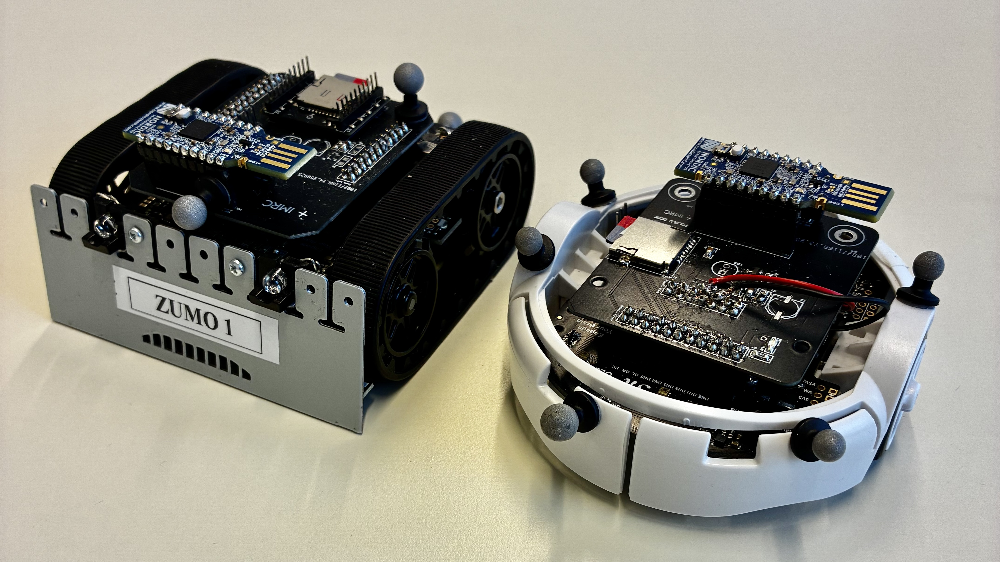

# pololu-rs
A Rust-based Framework for Reproducible Multi-Robot Experiments.




[Documentation](https://imrclab.github.io/pololu-rs/)  | [Paper](https://imrclab.github.io/assets/pdf/2026-pololu-rs.pdf)

---

## Overview
**pololu-rs** is a Rust-based research framework for commercially off-the-shelf (COTS) Pololu mobile robots. It combines open embedded firmware with a low-cost add-on board for logging and wireless communication, enabling reproducible and easy-to-deploy multi-robot experiments.

---

## Key Features 
- Firmware fully written in **Rust**.
- **Event-driven scheduling** instead of RTOS.
- **ROS2 communication interface**.
- **CRTP-based communication protocol**.
- **Integrated Xbox controller interface for remote control**.
- **Vicon-based trajectory tracking**.
- **Onboard QP solver for real-time control**.

---

## Hardware
The platform is built around **low-cost COTS robots** from [Pololu](https://www.pololu.com/), which provides:

- strong **Rust ecosystem support**.
- sufficient **computational resources** for onboard control.

A custom [add-on board](https://drive.google.com/file/d/1dhY1AWEnPq2iDd2syl0s_TQmvdr8CK_f/view) enables:

- onboard data logging.
- low-latency wireless communication.

---

## Example Applications
The platform supports a wide range of robotics experiments:

- multi-robot coordination
- trajectory tracking
- motion capture experiment with Vicon
- teleoperation
- optimization-based control

---

## Quickstart
Please Clone the repo with:
```bash
git clone --recurse-submodules https://github.com/IMRCLab/pololu-rs.git
```

For installation and setup instructions, please see the full documentation:

👉 [Quickstart](https://imrclab.github.io/pololu-rs/quickstart/)

The quickstart guide covers:
- hardware setup
- environment setup
- building the firmware
- flashing the robot
- running basic experiments

--- 
## Citation
If you use **pololu-rs** in your research, please cite the paper:
```
@misc{pololu_rs_2026,
  title={pololu-rs: A Rust-based Framework for Reproducible Multi-Robot Experiments},
  year={2026},
  url={https://imrclab.github.io/assets/pdf/2026-pololu-rs.pdf}
}
```

---

## License
MIT License

---

## Star History

[](https://star-history.com/#imrclab/pololu-rs&Date)