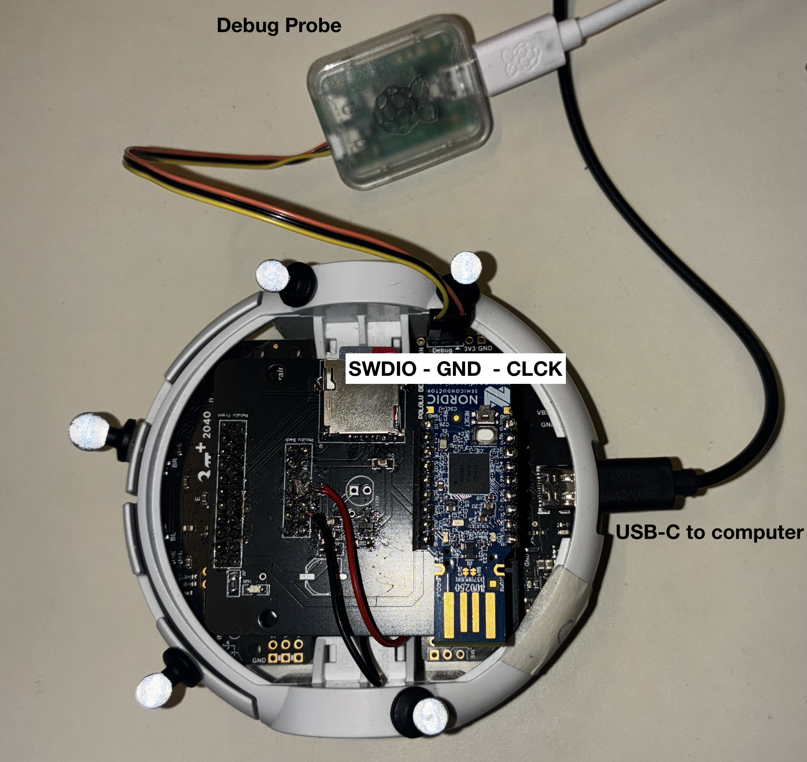

# Debugging
This document provides the users with 2 different ways to debugging the firmware.
<!-- Add a pro/con for the different methods, add sample debugging outputs for the different methods, what should I expect-->

<div style="height:4px; background:#1e90ff; margin:32px 0;"></div>

## Debugging with USB
```bash
sudo apt install tio
tio /dev/ttyACM0
```
(use ctrl+t q to exit)

<div style="height:4px; background:#1e90ff; margin:32px 0;"></div>

## Debugging with Raspberry Pi Debug Probe
The logging is mainly based on [probe-rs](https://probe.rs/docs/getting-started/installation/), [defmt](https://docs.rs/defmt/latest/defmt/) and [defmt-rtt](https://docs.rs/defmt-rtt/latest/defmt_rtt/).
There is also a useful [blog](https://murraytodd.medium.com/our-first-rust-blinky-program-on-raspberry-pi-pico-w-376211f1074d) to learn how to use them very quickly.

* Notice: The installation command on the home page of [probe-rs](https://probe.rs/) doesn't work for me due to some package conflicts. If so you could try following the [instructions](https://probe.rs/docs/getting-started/installation/) and install it from source.

---

### Debug Setup
* You will need a Raspberry Pi Debug Probe(for debugging) and a USB-C Cabel(for flashing).
* connect the probe properly to the Pololu. If the official probe is used, the connection should be:
  
        Yellow(SWDIO) -> SWDIO
        Orange(SWCLK)  -> SWCLK
        Black(GND)    -> GND




* Then connect the Pololu with the USB-C cabel to your PC, and the debug probe as well and uncomment in `config.toml`
        
        runner = "probe-rs run --chip RP2040 --protocol swd"

* If you would like to directly observed the debug information in the terminal, run:

        cargo run --release

* If you would like to save the logging information into a csv file, run:
  
    
        cargo run --release > file_name.csv
    

**OR** 

flash in bootloader mode and without debug information in the terminal by uncommenting 

    runner = "elf2uf2-rs -d"

in config.toml and then press "B" and "Reset" on the robot
and flash with
```
cargo run --release
```
or use the recommended `build_system`.

---

### Print New Debug Information 
The code only print a test value(constant). When new debug information is needed, use:
```
info!("New Sensor Data: {}", value);
```

<div style="height:4px; background:#1e90ff; margin:32px 0;"></div>


