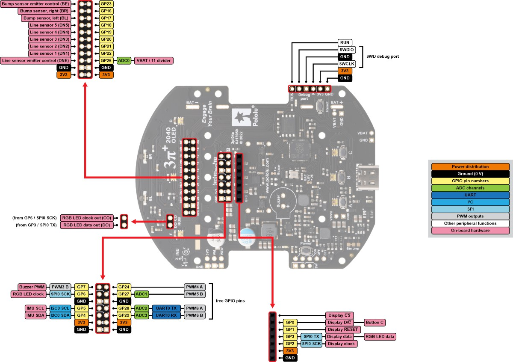
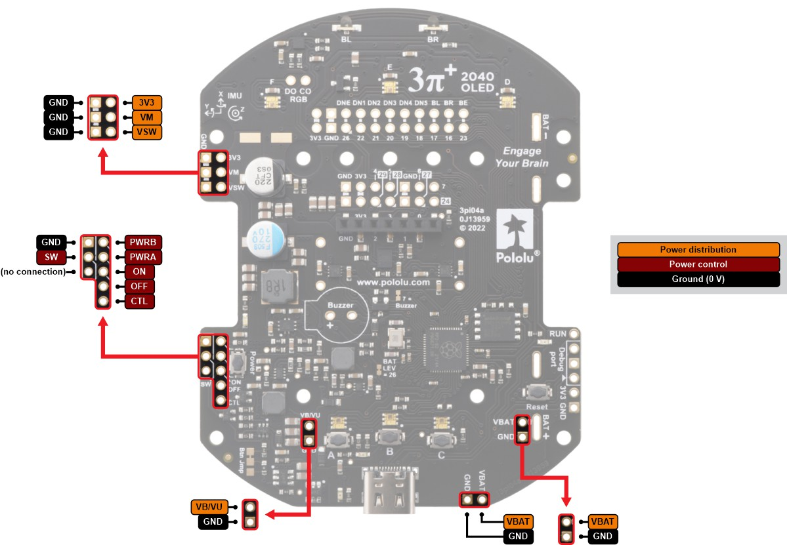
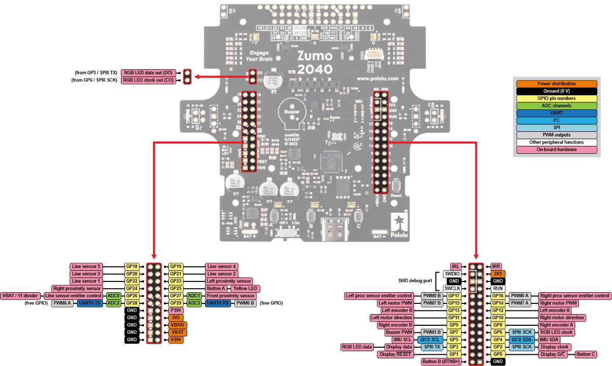
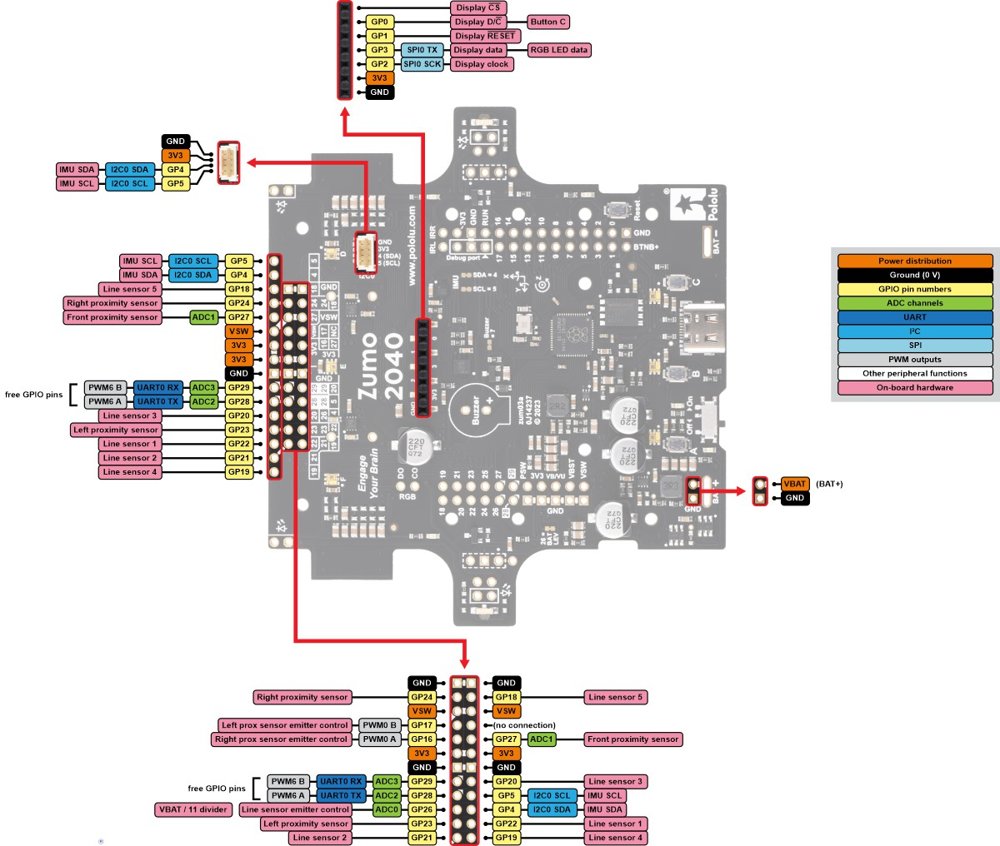

# Hardware Overview

This page provides an overview of the hardware components used on the  
**Pololu 3pi+ 2040** and **Pololu Zumo 2040** robots.  
Both platforms share the same RP2040 control board and peripheral layout.

---

## Common Hardware (shared by both robots)
- **RP2040 microcontroller** (same as Raspberry Pi Pico)
- Differential-drive system (2 motors + 2 encoders)
- LSM6DSO 6-axis IMU (Accel + Gyro)
- LIS3MDL 3-axis Magnetometer
- 5 × Line reflectance sensors (RC type)
- 2 × Bump sensors (IR reflectance)
- SH1106 128×64 OLED display (SPI)
- 6 × RGB LEDs (APA102-compatible)
- Micro SD card (requires individual deck for each robot)
- 3 user buttons (A, B, C)
- 1 buzzer (PWM capable)
- USB-C connector
- Full pinout compatibility with RPi Pico ecosystem

---

## Pinout Diagram

Below is a high-level overview.  

| Component | Pins | Notes |
|----------|------|-------|
| Motors (PWM) | GP14, GP15 | PWM7 A/B |
| Motor direction | GP10, GP11 | H-bridge control |
| Encoders | PIO inputs on GP8–GP13 | Quadrature |
| IMU I2C | SDA = GP4, SCL = GP5 | Shared bus |
| OLED SPI | GP0, GP1, GP2, GP3 | SH1106 |
| RGB LED SPI | GP3 (TX), GP6 (CLK) | APA102 |
| Line sensors | GP18–GP22 | RC decay timing |
| Bump sensors | GP16, GP17 | IR reflectance |
| SD Card Deck | GP18(SCK), GP19(MOSI), GP20(MOSI), GP21(CS) | SPI0 (shared conflict with Line sensors) |
| Buzzer | GP7 | PWM3B |
| Buttons A/B/C | GP25, GP1, GP0 | A shares LED pin |

---

## Pin Assignment for Zumo and 3pi
### Pololu 3pi+ Pin Assignment

### Pololu Zumo Pin Assignment

---

## Actuators

---

### Yellow LED
- Connected directly to RP2040 GPIO25  
- Same pin as Button A → **cannot use both simultaneously**
- Example uses: status blinking, debugging

---

### Motors

#### Pins
- **Direction:**  
  - GP10 → Right motor direction  
  - GP11 → Left motor direction  
- **PWM:**  
  - GP14 → Right motor speed (PWM7A)  
  - GP15 → Left motor speed (PWM7B)

#### Notes
- Zumo motors run in **reversed direction** (requires negated duty cycle)  
- 3pi motors are **normal direction**
- Needs to be checked before use.

---

### Quadrature Encoders

- Connected to both wheel shafts  
- Uses **custom PIO program** (reads rising & falling edges on phases A/B)
- Provides:  
  ✔ position (ticks)  
  ✔ velocity (RPM)

#### Pin usage  
- Typically **GP8–GP13** depending on model (RP2040 PIO banks)

---

### IMU (LSM6DSO + LIS3MDL)

#### LSM6DSO — 6-axis IMU
- Accelerometer + Gyroscope  
- I2C address: `0x6A`  
- Used for orientation & angular velocity

#### LIS3MDL — 3-axis Magnetometer
- I2C address: `0x1E`
- Provides heading estimation (Yaw)
- Not used currently in indoor environment due to drifting

#### Bus pins
- **SDA: GP4**  
- **SCL: GP5**  
- Both sensors share the same bus

---

### OLED Display (SH1106)

#### Connection
- **SPI0:**  
  - Data: GP0  
  - Reset: GP1  
  - SCK: GP2  
  - MOSI: GP3  

#### Features
- 128×64 pixels  
- Monochrome  
- Used for menus, data display, debugging

---

### RGB LEDs (APA102-compatible)

- 6 individually addressable LEDs  
- Arranged in a circular layout around the board  
- Order: A → F (counterclockwise)

#### Pins
- **Data (TX): GP3**  
- **Clock (SCK): GP6**

OLED and RGB LEDs share SPI0 but use different SCK pins → **no conflict**.

---

### Line Sensors (5×)

- Positions: under robot front edge  
- RC reflectance type (similar to Pololu QTR sensors)

#### Pins
- Emitter: GP26  
- Sensors:  
  - DN1 → GP22  
  - DN2 → GP21  
  - DN3 → GP20  
  - DN4 → GP19  
  - DN5 → GP18  

#### Notes
**These pins conflict with SD card deck SPI pins. SD logging requires disabling line sensors.**

---

### Bump Sensors (2×)

Located near front bumper skirt.

#### Pins
- BL → GP17  
- BR → GP16  
- Emitter → GP23  

Used to detect collision/contact direction.

---

### Buzzer

- Pin: **GP7**
- Supports hardware PWM mode (PWM3B)
- Can play simple tones, beeps, or melodies

---

### Buttons

| Button | Pin | Notes |
|--------|------|-------|
| A | GP25 | conflicts with LED |
| B | GP1 (QSPI_SS_N) | special function pin |
| C | GP0 | simple GPIO |

Pressing pulls the pin **to GND**.

---

### SD Card Deck

Compatible with **Crazyflie micro SD card deck**. There are also decks specially designed for both robots that help us get rid of the cables when using the **Crazyflie micro SD deck**.

#### Pins (SPI0)
- CLK: GP18  
- MOSI: GP19  
- MISO: GP20  
- CS: GP21  

#### Important
- These pins **conflict with line sensors** → only one can be used at a time  
- Required for trajectory logging (CSV), trajectory loading and robot configuration parameters loading.  

---
