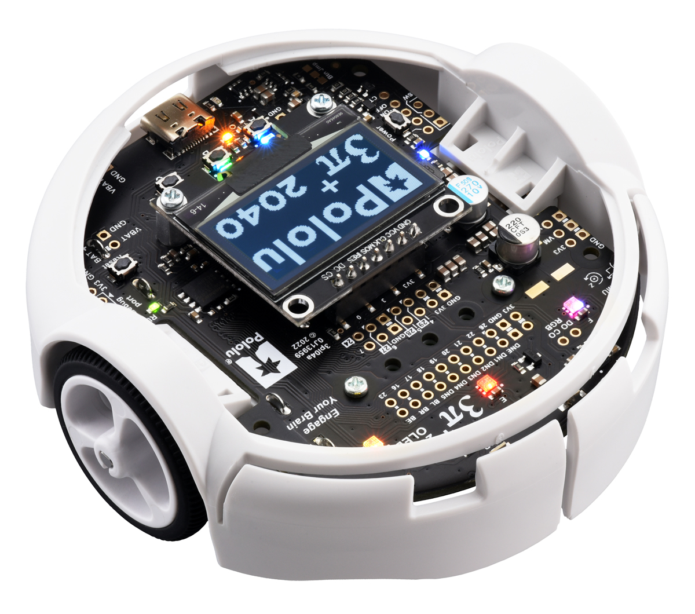
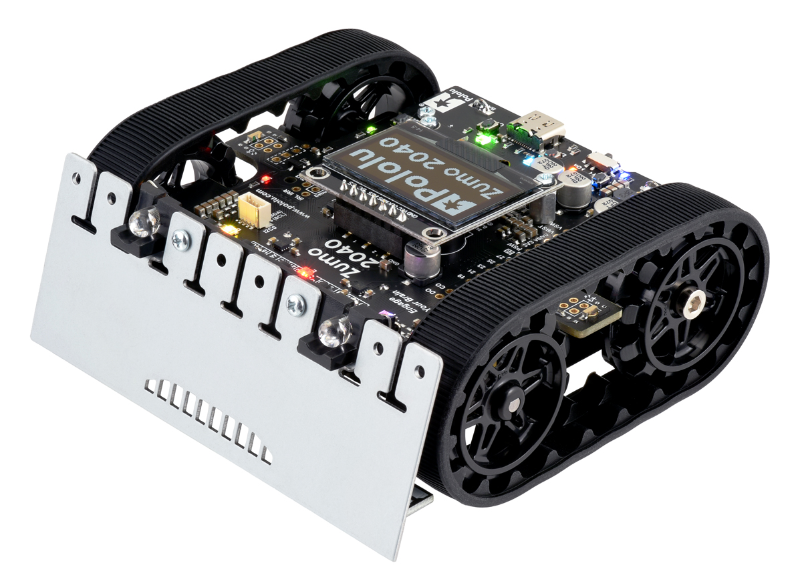

# Pololu 3pi+ 2040 / Zumo 2040 — Rust Firmware
<!-- In my opinion we are missing a "trajectory generation "-> into usage.md (example file, limits)  and a "motion tracking" ->  give info about quaternion etc format example, s

section, maybe it can also be combined to "interfaces". I also would like to add a section "your code" or something like this, where we can explain how this platform is actually used as a basis to develop your own stuff-->

This library provides a high-performance async Rust firmware for [Pololu 3pi+ 2040 robot](https://www.pololu.com/category/300/3pi-plus-2040-robot) and [Pololu Zumo 2040 robot](https://www.pololu.com/category/308/zumo-2040-robot),  
featuring differential-drive control, tele-operation via joysticks, trajectory following, IMU fusion, SD logging, and ROS 2 support. `Pololu 3pi+` is a differential-drive robot that can move with up to 4m/s. `Pololu Zumo` is a tracked robot that can move on different terrains. These robots are suitable for developing motion planning algorithms and multi-agent algorithms.

---

## Robot Platforms

  <figure style="text-align: center; width: 40%;">
    
    <figcaption><strong>Pololu 3pi+ 2040</strong></figcaption>
  </figure>

  <figure style="text-align: center; width: 50%;">
    
    <figcaption><strong>Pololu Zumo 2040</strong></figcaption>
  </figure>

---

## Features

- **Rust + Embassy** async firmware  
- **Motor + Encoder** closed-loop control  
- **LSM6DSO + LIS3MDL IMU** support  
- **Madgwick / Complementary filter**  
- **SD card logging**  
- **UART packet decoding**  
- **ROS 2 interface** (multi-robot support)  
- **Tele-Operation via joystick**
- **Trajectory following** (direct or MoCap-based)

---

## Documentation

### Quick Start
→ [Quick Start Guide](quickstart.md)

### Hardware  
→ [Hardware Overview](hardware.md)

### Software  
→ [Software Architecture](software.md)

### Build & Flashing  
→ [Build & Flash Guide](build.md)

### Debugging  
→ [Debugging with probe-rs](debugging.md)

### ROS 2 Interface  
→ [ROS Interface](ros.md)

### Usage  
→ [Teleop / Trajectory Following](usage.md)

### Troubleshooting  
→ [Troubleshooting Guide](troubleshooting.md)

---

## Repository
GitHub: [pololu](https://github.com/IMRCLab/pololu3pi2040-rs)

## Disclaimer
This documentation is based on the firmware at 08.12.2025. It does not claim completeness in any way or form. If you'd like to, you're welcome to provide feedback and suggestions via GitHub.
